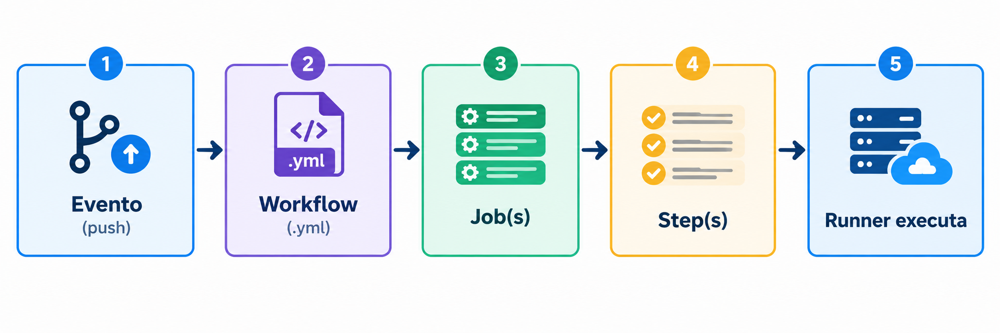

# Aula 08 — Trabalho Anterior (TA)

## Objetivo

Preparar-se para a Aula 08 através de leitura prévia sobre **GitHub Actions**, **CI Pipelines** e **Secrets Management**. Esta é a primeira aula do Módulo 3 focada em CI/CD — você vai aprender a automatizar verificações de qualidade e proteger credenciais sensíveis.

---

## Parte 1 — GitHub Actions e CI

### 1.1 O que é CI/CD?

CI/CD é um conjunto de práticas de desenvolvimento que automatizam a entrega de software:

**Continuous Integration (CI):**
- Desenvolvedores integram código frequentemente (várias vezes ao dia)
- Cada integração é verificada por um build automatizado
- Testes rodam automaticamente em cada push
- Feedback rápido: em minutos, você sabe se quebrou algo

**Continuous Delivery (CD):**
- O código está sempre em estado deployável
- Deploy para produção requer apenas um clique (ou aprovação)
- Processo de release é previsível e repetível

**Continuous Deployment:**
- Deploy automático em cada commit que passa no CI
- Sem intervenção humana entre commit e produção
- Requer alta confiança nos testes e monitoramento

**O problema da TechNova sem CI:**

Hoje, o deploy da TechNova leva 32 minutos e envolve:
1. SSH no servidor de produção
2. `git pull` para buscar as mudanças
3. `npm install` para atualizar dependências
4. Reiniciar o serviço manualmente
5. Verificar manualmente se está funcionando
6. Nenhuma verificação de qualidade antes do deploy

Resultado: bugs vão para produção, ninguém verifica lint, testes não rodam, e credenciais já foram commitadas no código.

### 1.2 GitHub Actions — Arquitetura

GitHub Actions é a plataforma de CI/CD integrada ao GitHub. Sua arquitetura é composta por:

**Workflows:**
- Arquivos YAML em `.github/workflows/`
- Definem toda a automação
- Um repositório pode ter múltiplos workflows

**Events (Triggers):**
- O que dispara um workflow
- Exemplos: push, pull_request, workflow_dispatch (manual), schedule (cron)
- Podem ser filtrados por branch, path, tags

**Jobs:**
- Unidade de execução dentro de um workflow
- Cada job roda em um runner separado (VM limpa)
- Jobs podem rodar em paralelo ou ter dependências (`needs`)

**Steps:**
- Ações individuais dentro de um job
- Podem ser: `uses` (action do marketplace) ou `run` (comando shell)
- Executam sequencialmente dentro do job

**Runners:**
- Máquinas virtuais que executam os jobs
- GitHub oferece runners hospedados: ubuntu-latest, windows-latest, macos-latest
- Cada job inicia com uma VM limpa (nada persiste entre jobs)



### 1.3 Sintaxe YAML para Workflows

Estrutura básica de um workflow:

```yaml
name: Nome do Workflow         # Nome exibido na UI

on:                             # Triggers
  push:
    branches: [main]
  pull_request:
    branches: [main]

jobs:                           # Jobs a executar
  nome-do-job:
    runs-on: ubuntu-latest      # Runner
    steps:                      # Steps do job
      - uses: actions/checkout@v4    # Action
      - run: npm ci                  # Comando shell
```

**Triggers mais comuns:**

| Trigger | Quando dispara | Uso típico |
|---------|---------------|-----------|
| `push` | Novo push para branch | CI em main/develop |
| `pull_request` | PR aberto/atualizado | Verificar antes do merge |
| `workflow_dispatch` | Botão manual na UI | Deploy sob demanda |
| `schedule` | Cron expression | Testes noturnos |

### 1.4 Actions do Marketplace

Actions são componentes reutilizáveis mantidos pela comunidade e pelo GitHub:

| Action | O que faz | Por que usar |
|--------|----------|-------------|
| `actions/checkout@v4` | Clona o repositório no runner | Necessário para acessar o código |
| `actions/setup-node@v4` | Instala Node.js na versão desejada | Garante ambiente consistente |
| `actions/cache@v4` | Cache de diretórios (node_modules) | Acelera execuções futuras |
| `actions/upload-artifact@v4` | Salva arquivos após o job | Reports, builds, coverage |

**Versioning de actions:**
- `@v4` = versão major (recomendado — recebe patches)
- `@v4.1.0` = versão exata (mais seguro, menos updates)
- `@main` = branch (instável, evitar em produção)

### 1.5 Multi-Stage CI Pipeline

Um pipeline profissional tem múltiplos estágios com dependências:

```
lint → test → build
```

**Por que essa ordem?**
1. **Lint primeiro:** É o mais rápido (~10s). Se o código tem erros de estilo, nem vale rodar testes.
2. **Test segundo:** Verifica se a lógica funciona. Se tests falham, não vale buildar.
3. **Build por último:** Mais demorado (Docker build). Só executa se tudo antes passou.

A keyword `needs` define a ordem:

```yaml
jobs:
  lint:
    runs-on: ubuntu-latest
    # ... steps de lint

  test:
    needs: lint               # Só roda se lint passar
    runs-on: ubuntu-latest
    # ... steps de teste

  build:
    needs: [lint, test]       # Só roda se AMBOS passarem
    runs-on: ubuntu-latest
    # ... steps de build
```

### 1.6 ESLint — Análise Estática

ESLint verifica código JavaScript/Node.js sem executá-lo:

**O que detecta:**
- Variáveis declaradas mas não usadas
- Uso de `var` ao invés de `let`/`const`
- Comparações com `==` (deveria ser `===`)
- Formatação inconsistente (aspas, ponto-e-vírgula)
- Imports desnecessários
- Possíveis bugs (unreachable code, undefined variables)

**Configuração básica (`.eslintrc.json`):**

```json
{
  "env": {
    "node": true,
    "es2021": true,
    "jest": true
  },
  "extends": "eslint:recommended",
  "rules": {
    "no-unused-vars": "warn",
    "no-console": "off",
    "semi": ["error", "always"]
  }
}
```

**Como usar no pipeline:**
- `npm run lint` retorna exit code 0 (sucesso) ou 1 (erro)
- GitHub Actions interpreta exit code 1 como falha do step
- Pipeline para automaticamente se lint falhar

### 1.7 Jest — Testes Unitários

Jest é o framework de testes mais popular para Node.js:

**Estrutura de um teste:**

```javascript
describe('Nome do módulo/funcionalidade', () => {
  it('deve fazer X quando Y', () => {
    // Arrange (preparar)
    const input = 'valor';

    // Act (executar)
    const result = minhaFuncao(input);

    // Assert (verificar)
    expect(result).toBe('resultado esperado');
  });
});
```

**Matchers comuns:**
- `toBe(value)` — igualdade estrita (===)
- `toEqual(object)` — igualdade profunda (objetos/arrays)
- `toBeTruthy()` / `toBeFalsy()` — verdadeiro/falso
- `toContain(item)` — array contém item
- `toThrow()` — função lança erro
- `toHaveBeenCalled()` — mock foi chamado

**Coverage (cobertura de testes):**
- Jest pode medir quais linhas de código são executadas pelos testes
- `--coverage` gera relatório HTML
- CI pode falhar se coverage estiver abaixo de um threshold

### 1.8 Artifacts

Artifacts são arquivos salvos após a execução de um job:

**Usos comuns:**
- Relatório de coverage (HTML)
- Build compilado (binário, imagem Docker tarball)
- Logs de execução
- Screenshots de testes E2E

```yaml
- name: Upload coverage
  uses: actions/upload-artifact@v4
  with:
    name: coverage-report
    path: coverage/
    retention-days: 30          # Mantém por 30 dias
```

### 1.9 Status Badges

Badges mostram o estado do pipeline diretamente no README:

```markdown

```

O badge atualiza automaticamente:
- 🟢 **passing** — último run bem-sucedido
- 🔴 **failing** — último run falhou
- 🟡 **running** — em execução

---

## Parte 2 — Secrets Management

### 2.1 O Problema: Credenciais no Código

Um dos erros mais graves em desenvolvimento é commitar credenciais no repositório:

**Cenário real da TechNova:**
- Desenvolvedor cria `.env` com AWS keys para testar localmente
- Esquece de adicionar `.env` no `.gitignore`
- Faz `git add .` e `git push`
- Credenciais ficam no histórico do Git (mesmo se deletar depois!)
- Bots automatizados escaneiam GitHub e encontram em segundos
- AWS keys usadas para minerar criptomoedas na conta da empresa
- Conta AWS: fatura de $50.000 em um final de semana

**A regra de ouro:**


### 2.2 GitHub Secrets

GitHub Secrets é o sistema nativo do GitHub para armazenar credenciais:

**Tipos de secrets:**

| Tipo | Escopo | Acesso | Uso |
|------|--------|--------|-----|
| Repository secrets | Todo o repositório | Todos os workflows | AWS keys, tokens gerais |
| Environment secrets | Um environment específico | Jobs com `environment:` | Secrets de produção |
| Organization secrets | Toda a organização | Repos selecionados | Secrets compartilhados |

**Características:**
- Criptografados em repouso (sealed box encryption)
- Nunca visíveis após criados (apenas deletar/atualizar)
- Mascarados automaticamente nos logs (`***`)
- Não passados para workflows de forks (segurança em PRs externos)

### 2.3 Referenciando Secrets: `${{ secrets.NAME }}`

A sintaxe para usar secrets no workflow:

```yaml
jobs:
  deploy:
    runs-on: ubuntu-latest
    steps:
      - name: Configurar AWS
        env:
          AWS_ACCESS_KEY_ID: ${{ secrets.AWS_ACCESS_KEY_ID }}
          AWS_SECRET_ACCESS_KEY: ${{ secrets.AWS_SECRET_ACCESS_KEY }}
        run: aws sts get-caller-identity
```

**Importante:**
- Se o secret não existir, `${{ secrets.NAME }}` retorna string vazia (não erro!)
- Secrets são passados como variáveis de ambiente ao step
- O valor real nunca aparece nos logs (substituído por `***`)

### 2.4 GITHUB_TOKEN

Todo workflow recebe automaticamente um token `GITHUB_TOKEN`:

**O que pode fazer:**
- Ler conteúdo do repositório
- Criar/atualizar issues e PRs
- Comentar em PRs
- Criar releases
- Push para o próprio repositório

**O que NÃO pode fazer:**
- Acessar outros repositórios
- Modificar configurações do repositório
- Acessar secrets de outros repos

```yaml
- name: Criar release
  uses: actions/create-release@v1
  env:
    GITHUB_TOKEN: ${{ secrets.GITHUB_TOKEN }}
  with:
    tag_name: v1.0.0
    release_name: Release 1.0.0
```

### 2.5 Environments com Protection Rules

Environments adicionam camadas de segurança para deploys:

**Configuração de environment:**
1. Settings → Environments → New environment
2. Nome: "production" ou "staging"
3. Protection rules:
   - Required reviewers (quem pode aprovar)
   - Wait timer (delay antes de executar)
   - Deployment branches (quais branches podem deployar)
4. Environment secrets (secrets específicos daquele ambiente)

**Approval Gates:**
- Quando um job usa `environment: production` com required reviewers:
  1. O pipeline executa até aquele job
  2. Para e espera aprovação
  3. Reviewer recebe notificação
  4. Reviewer aprova ou rejeita
  5. Se aprovado, job continua

### 2.6 Boas Práticas de Credenciais

| Prática | Implementação |
|---------|--------------|
| Nunca commitar secrets | `.gitignore` com `.env`, `*.pem`, `credentials` |
| Rotacionar regularmente | A cada 90 dias ou após incidente |
| Menor privilégio | IAM keys com apenas as permissões necessárias |
| Nunca logar/printar | Evitar `echo $SECRET` mesmo em debug |
| Usar environments | Separar secrets de staging e production |
| Auditar acesso | Verificar quem/quando acessou secrets |
| Ter plano de incidente | O que fazer se um secret vazar |
| Usar short-lived credentials | Preferir OIDC/AssumeRole ao invés de long-lived keys |

---

## Questões de Múltipla Escolha

Responda as questões abaixo para verificar sua compreensão. Traga suas respostas para a discussão em aula.

### Questão 1

**O que dispara a execução de um workflow do GitHub Actions?**

a) O workflow é executado automaticamente a cada 5 minutos pelo GitHub

b) Eventos configurados no campo `on:` do YAML, como push, pull_request ou workflow_dispatch

c) O desenvolvedor precisa clicar em "Run" na UI do GitHub para cada execução

d) O workflow só executa quando um administrador do repositório faz deploy

### Questão 2

**Qual é a função da keyword `needs` em um workflow multi-stage?**

a) Define quais secrets o job precisa para executar

b) Indica quais runners são necessários para o job

c) Cria dependência entre jobs — o job só executa se os jobs listados em `needs` passarem

d) Define quantas vezes o job deve ser executado (retry count)

### Questão 3

**Onde devem ser armazenadas credenciais AWS (access key e secret key) para uso em GitHub Actions?**

a) No arquivo `.env` commitado no repositório, pois o GitHub mascara automaticamente

b) Como variáveis de ambiente definidas no `runs-on` do job

c) Em GitHub Secrets (Settings → Secrets), referenciadas com `${{ secrets.NAME }}`

d) Diretamente no YAML do workflow, em um campo `credentials:`

### Questão 4

**Qual é o propósito de environments com approval gates no GitHub Actions?**

a) Acelerar o pipeline fazendo jobs rodarem em paralelo

b) Garantir que deploys para ambientes sensíveis (como produção) requeiram aprovação humana antes de executar

c) Permitir que secrets sejam visíveis nos logs para debugging

d) Criar cópias do repositório em diferentes servidores

---

> As respostas das questões serão discutidas no início da aula.

---

## Preparação para a Aula

- [ ] Li toda a Parte 1 (GitHub Actions e CI)
- [ ] Li toda a Parte 2 (Secrets Management)
- [ ] Respondi as 4 questões de múltipla escolha
- [ ] Anotei dúvidas para discutir em aula
- [ ] Tenho conta GitHub ativa com um repositório `unifaat-devops-portfolio`
- [ ] Tenho Node.js (≥18) e npm instalados (`node --version`, `npm --version`)
- [ ] Entendo que GitHub Actions é gratuito para repos públicos
- [ ] Refleti: já commitei credenciais no código alguma vez? Como prevenir?

---

## Referências

### GitHub Actions

- GitHub. **Understanding GitHub Actions**. GitHub Docs. Disponível em: [https://docs.github.com/en/actions/about-github-actions/understanding-github-actions](https://docs.github.com/en/actions/about-github-actions/understanding-github-actions)
- GitHub. **Workflow syntax for GitHub Actions**. GitHub Docs. Disponível em: [https://docs.github.com/en/actions/writing-workflows/workflow-syntax-for-github-actions](https://docs.github.com/en/actions/writing-workflows/workflow-syntax-for-github-actions)
- GitHub. **Events that trigger workflows**. GitHub Docs. Disponível em: [https://docs.github.com/en/actions/writing-workflows/choosing-when-your-workflow-runs/events-that-trigger-workflows](https://docs.github.com/en/actions/writing-workflows/choosing-when-your-workflow-runs/events-that-trigger-workflows)
- GitHub. **Using jobs in a workflow**. GitHub Docs. Disponível em: [https://docs.github.com/en/actions/writing-workflows/choosing-what-your-workflow-does/using-jobs-in-a-workflow](https://docs.github.com/en/actions/writing-workflows/choosing-what-your-workflow-does/using-jobs-in-a-workflow)

### Secrets e Segurança

- GitHub. **Using secrets in GitHub Actions**. GitHub Docs. Disponível em: [https://docs.github.com/en/actions/security-for-github-actions/security-guides/using-secrets-in-github-actions](https://docs.github.com/en/actions/security-for-github-actions/security-guides/using-secrets-in-github-actions)
- GitHub. **Security hardening for GitHub Actions**. GitHub Docs. Disponível em: [https://docs.github.com/en/actions/security-for-github-actions/security-guides/security-hardening-for-github-actions](https://docs.github.com/en/actions/security-for-github-actions/security-guides/security-hardening-for-github-actions)
- GitHub. **Keeping your GitHub Actions and workflows secure**. GitHub Docs. Disponível em: [https://docs.github.com/en/actions/security-for-github-actions](https://docs.github.com/en/actions/security-for-github-actions)

### CI/CD e Integração Contínua

- FOWLER, Martin. **Continuous Integration**. martinfowler.com. Disponível em: [https://martinfowler.com/articles/continuousIntegration.html](https://martinfowler.com/articles/continuousIntegration.html)
- DORA. **State of DevOps Report**. Google. Disponível em: [https://dora.dev/research/](https://dora.dev/research/)

### Node.js — ESLint e Jest

- ESLint. **Getting Started with ESLint**. Disponível em: [https://eslint.org/docs/latest/use/getting-started](https://eslint.org/docs/latest/use/getting-started)
- Jest. **Getting Started**. Jest Documentation. Disponível em: [https://jestjs.io/docs/getting-started](https://jestjs.io/docs/getting-started)
