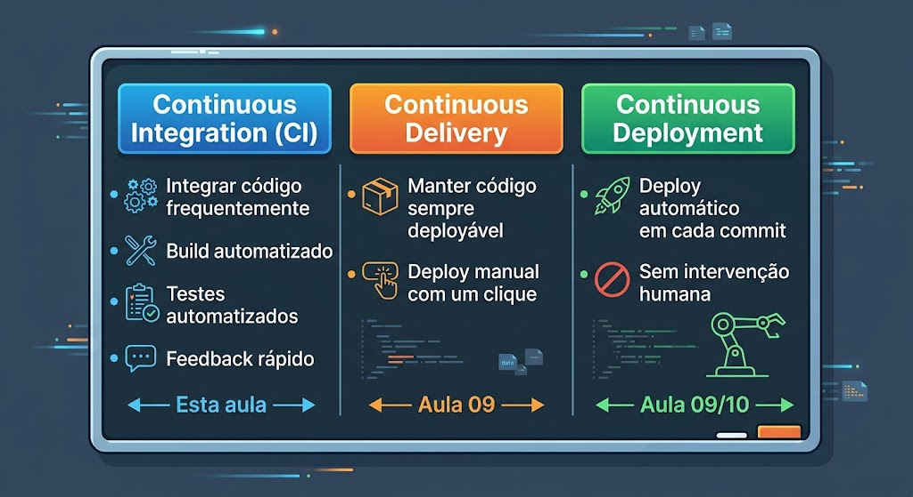
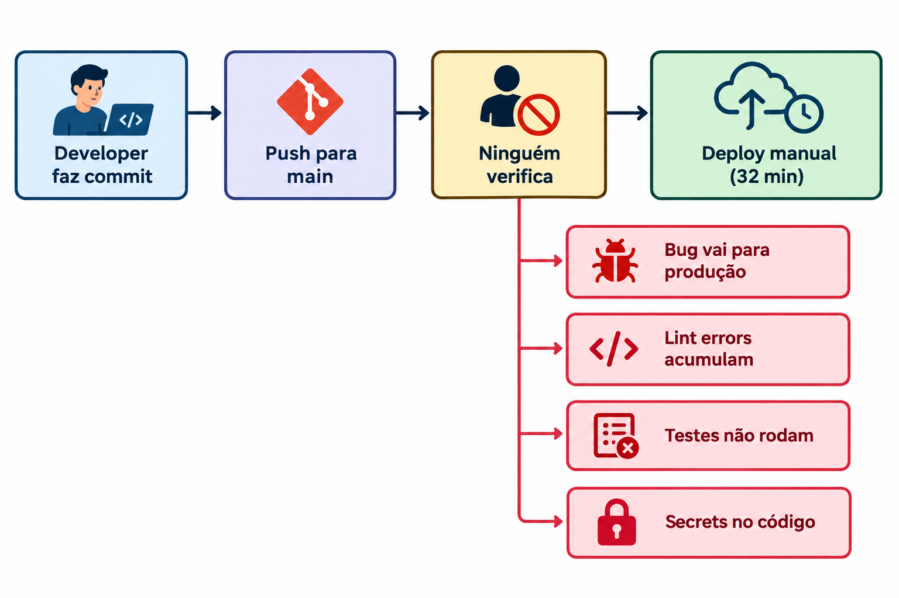
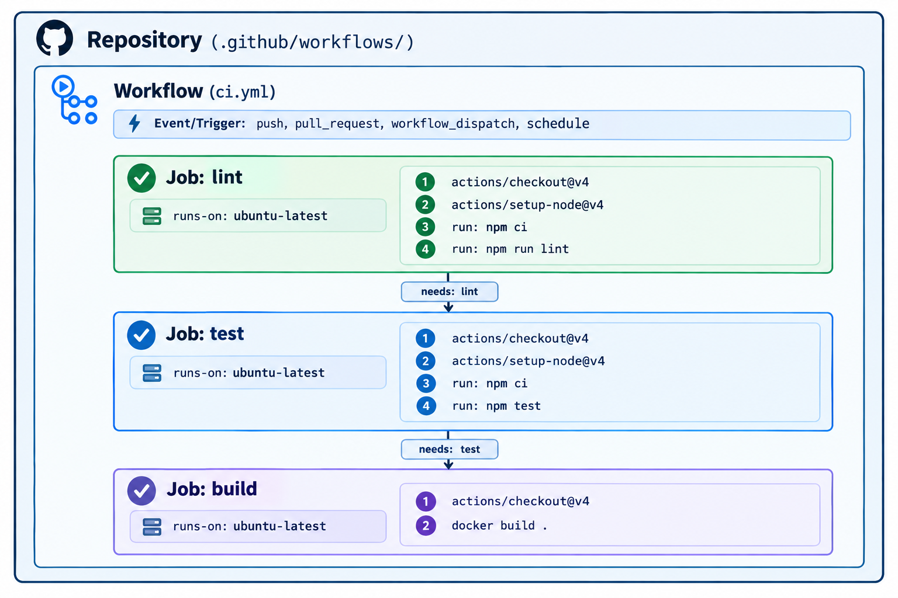
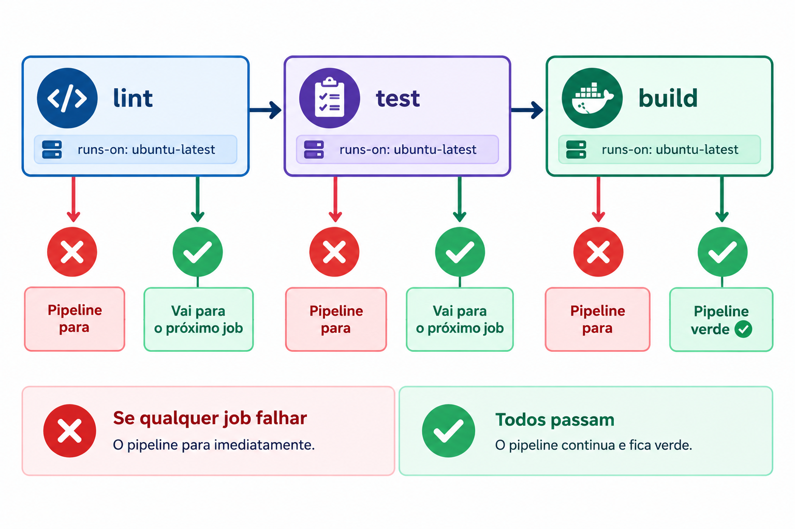
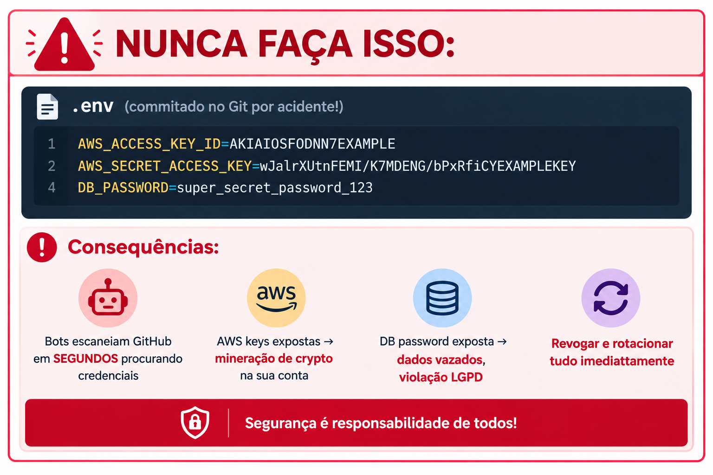
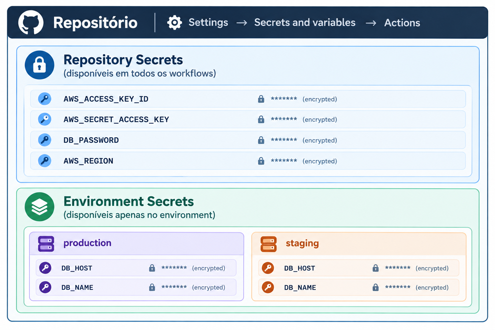
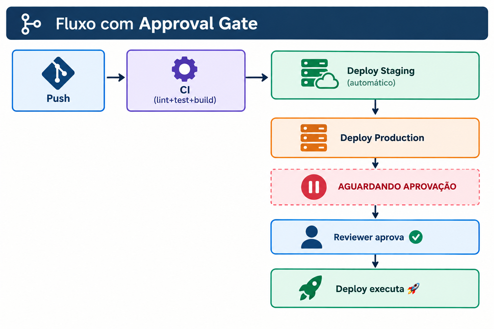

<!-- _class: title -->

# Aula 08 — GitHub Actions: CI Completo com Secrets

**DevOps — Centro Universitário UniFAAT**
Prof. Alexandre Tavares | Semestre 2026-2

---

# O Problema da TechNova

Rafael confessou na reunião de sprint:
> "O deploy ainda é manual — 32 minutos, SSH, git pull, npm install, restart. Ontem esqueci de rodar os testes e um bug foi para produção."

Marina encontrou algo pior:
> "Alguém commitou as credenciais AWS no código. O `.env` com `AWS_ACCESS_KEY_ID` ficou no repositório público por **4 horas**."

**Três problemas a resolver hoje:**
1. Deploy manual e demorado
2. Nenhuma verificação automática de qualidade
3. Credenciais expostas no código

> **Solução:** pipeline CI que **pega tudo** automaticamente + sistema de secrets que nunca expõe credenciais.

---

# Objetivos de Aprendizagem

### GitHub Actions e CI
- Compreender a arquitetura do GitHub Actions (workflows, jobs, steps, runners)
- Criar workflows YAML com triggers (push, pull_request, workflow_dispatch)
- Estruturar pipeline multi-estágio com dependências (lint → test → build)
- Configurar ESLint e Jest no CI

### Secrets e Environments
- Configurar GitHub Secrets e referenciar com `${{ secrets.NAME }}`
- Usar `GITHUB_TOKEN` para interações com a API do GitHub
- Implementar environments com protection rules

---

# O que é CI/CD?

CI/CD automatiza o ciclo de vida do software:



**O problema SEM CI:**



---

# Com CI — o que vamos construir

```
Developer faz commit → Push/PR → GitHub Actions executa automaticamente:
                                    │
                                    ├── ESLint verifica código  ✅/❌
                                    ├── Jest roda testes        ✅/❌
                                    ├── Docker build verifica   ✅/❌
                                    └── Se TUDO passar → pronto para deploy
                                        Se ALGO falhar → PR bloqueado, dev notificado
```

> **Nenhum bug passa sem ser detectado. Nenhuma credencial entra no código.**

---

# GitHub Actions — Arquitetura



| Componente | O que é | Analogia |
|-----------|---------|---------|
| **Workflow** | Arquivo YAML que define a automação | A "receita" completa |
| **Event/Trigger** | O que dispara o workflow | O "gatilho" |
| **Job** | Conjunto de steps no mesmo runner | Uma "etapa" |
| **Step** | Uma ação individual | Um "comando" |
| **Runner** | VM que executa os jobs | O "servidor" temporário |
| **Action** | Componente reutilizável do marketplace | Uma "ferramenta" pronta |

---

# Sintaxe YAML de Workflows

```yaml
# .github/workflows/ci-aula08.yml  (na raiz do unifaat-devops-portfolio)
name: CI Pipeline — Aula 08

on:
  push:
    branches: [main, develop]
    paths: ['aula-08/technova-api/**']
  pull_request:
    branches: [main]
    paths: ['aula-08/technova-api/**']
  workflow_dispatch:

defaults:
  run:
    working-directory: aula-08/technova-api

jobs:
  lint:
    runs-on: ubuntu-latest
    steps:
      - uses: actions/checkout@v4
      - uses: actions/setup-node@v4
        with:
          node-version: '20'
      - run: npm ci
      - run: npm run lint
```

---

# Triggers — Eventos que disparam workflows

```yaml
on:
  push:
    branches: [main, develop]
    paths: ['src/**', 'package.json']   # Só se esses arquivos mudarem

  pull_request:
    branches: [main]
    types: [opened, synchronize, reopened]

  workflow_dispatch:                     # Botão manual na UI
    inputs:
      environment:
        required: true
        type: choice
        options: [staging, production]

  schedule:
    - cron: '0 6 * * 1'                 # Toda segunda às 06:00 UTC
```

---

# Multi-Stage Pipeline com `needs`

A keyword `needs` cria dependências — jobs só rodam se o anterior passou:

```yaml
jobs:
  lint:
    runs-on: ubuntu-latest
    steps:
      - uses: actions/checkout@v4
      - run: npm ci && npm run lint

  test:
    needs: lint                  # Só roda SE lint passar
    runs-on: ubuntu-latest
    steps:
      - uses: actions/checkout@v4
      - run: npm ci && npm test

  build:
    needs: [lint, test]          # Só roda SE lint E test passarem
    runs-on: ubuntu-latest
    steps:
      - uses: actions/checkout@v4
      - run: docker build -t technova-api .
```



---

# ESLint — Análise Estática de Código

```json
// .eslintrc.json
{
  "env": { "node": true, "es2021": true, "jest": true },
  "extends": "eslint:recommended",
  "rules": {
    "no-unused-vars": "warn",
    "semi": ["error", "always"],
    "quotes": ["error", "single"]
  }
}
```

**O que ESLint pega:**
- Variáveis não utilizadas
- Erros de sintaxe e padrões inconsistentes
- Comparações perigosas (`==` em vez de `===`)

**Conexão Spec-Driven:** descreva o padrão de código desejado para o Kiro e peça que o `.eslintrc.json` seja gerado. Valide se as regras fazem sentido para o projeto.

---

# Jest — Testes Unitários

```javascript
// __tests__/server.test.js
const request = require('supertest');
const app = require('../server');

describe('GET /health', () => {
  it('deve retornar status 200', async () => {
    const res = await request(app).get('/health');
    expect(res.statusCode).toBe(200);
    expect(res.body.status).toBe('ok');
  });
});

describe('GET /api/orders', () => {
  it('deve retornar array de orders', async () => {
    const res = await request(app).get('/api/orders');
    expect(res.statusCode).toBe(200);
    expect(Array.isArray(res.body)).toBe(true);
  });
});
```

---

# O Problema: Credenciais no Código

Um erro que acontece toda semana em algum repositório público:



> Bots escaneiam repositórios GitHub em segundos. Uma credencial exposta por 4 horas já é suficiente para comprometer toda a conta AWS.

---

# GitHub Secrets — A Solução

Variáveis criptografadas armazenadas no GitHub:



```yaml
jobs:
  deploy:
    runs-on: ubuntu-latest
    steps:
      - name: Configurar AWS CLI
        env:
          AWS_ACCESS_KEY_ID: ${{ secrets.AWS_ACCESS_KEY_ID }}
          AWS_SECRET_ACCESS_KEY: ${{ secrets.AWS_SECRET_ACCESS_KEY }}
        run: aws sts get-caller-identity
```

---

# Regras de Segurança dos Secrets

| Regra | Por quê |
|-------|---------|
| **Nunca commitar secrets no Git** | Bots escaneiam repos em segundos |
| **Usar `.gitignore` para `.env`** | Previne commits acidentais |
| **Rotacionar regularmente** | Minimiza impacto de vazamento |
| **Menor privilégio** | Secret só acessa o necessário |
| **Nunca logar secrets** | Mesmo mascarados, evite imprimir |
| **Environment secrets para prod** | Adiciona camada de aprovação |

**Propriedades dos Secrets:**
- Mascarados nos logs (`***`)
- **Não passados** para workflows de forks (segurança)
- Não visíveis após criados (só atualizáveis)

---

# GITHUB_TOKEN — Token Automático

Todo workflow recebe automaticamente um `GITHUB_TOKEN`:

```yaml
steps:
  - name: Comentar no PR
    uses: actions/github-script@v7
    with:
      github-token: ${{ secrets.GITHUB_TOKEN }}
      script: |
        github.rest.issues.createComment({
          issue_number: context.issue.number,
          owner: context.repo.owner,
          repo: context.repo.repo,
          body: '✅ CI passou! Pipeline verde.'
        })
```

**Permissões:** ler/escrever issues e PRs, ler conteúdo do repo, publicar packages, criar releases.

---

# Environments com Protection Rules

Separar configurações por estágio — staging roda automaticamente, production exige aprovação:

```yaml
jobs:
  deploy-staging:
    runs-on: ubuntu-latest
    environment: staging       # Secrets de staging, sem aprovação

  deploy-production:
    needs: deploy-staging
    runs-on: ubuntu-latest
    environment: production    # Requer aprovação antes de executar
```



---

# Spec-Driven aplicado ao CI

Você pode usar o **Kiro Spec** para gerar os workflows:

| Etapa | O que você faz |
|---|---|
| **1. Requisitos** | Descreve: lint com ESLint, testes com Jest, build Docker, secrets AWS |
| **2. Design** | Kiro propõe estrutura `.github/workflows/ci.yml` |
| **3. Tarefas** | Kiro ordena: setup → lint job → test job → build job → secrets |
| **4. Código** | Kiro gera; você valida com checklist |

**Checklist de validação:**
- `needs` correto entre jobs?
- Secrets referenciados com `${{ secrets.NAME }}` (não hardcoded)?
- Trigger cobre push + PR?
- Nenhum secret logado com `echo`?

---

# Resumo dos Conceitos

| Conceito | Descrição |
|----------|-----------|
| CI | Integrar e verificar código automaticamente em cada push |
| Workflow | Arquivo YAML em `.github/workflows/` |
| Job | Conjunto de steps no mesmo runner |
| `needs` | Dependência entre jobs (lint → test → build) |
| ESLint | Análise estática para JavaScript |
| Jest | Framework de testes unitários |
| GitHub Secrets | Variáveis criptografadas no repositório |
| `${{ secrets.NAME }}` | Sintaxe para referenciar secrets |
| `GITHUB_TOKEN` | Token automático para API do GitHub |
| Environment | Contexto com secrets e protection rules |
| Approval Gate | Aprovação obrigatória antes de executar |

---

# Referências e Próximos Passos

**Referências:**
- GitHub Actions Docs — [docs.github.com/en/actions](https://docs.github.com/en/actions)
- GitHub Secrets — [docs.github.com/en/actions/security-guides](https://docs.github.com/en/actions/security-guides/encrypted-secrets)
- ESLint — [eslint.org](https://eslint.org/)
- Jest — [jestjs.io](https://jestjs.io/)

**Para a próxima aula:**
- Completar o TF desta aula (portfólio + PR)
- Estudar o `TA.md` da Aula 09

**Próxima aula:**
**Aula 09 — Docker Registry + IA no CI/CD**
Build/push para registry e PR review automatizado com IA.
